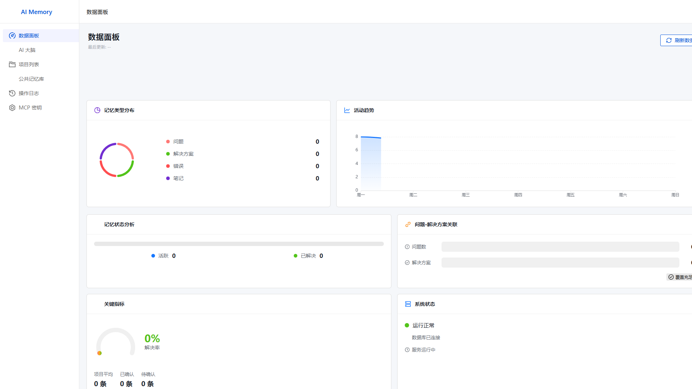
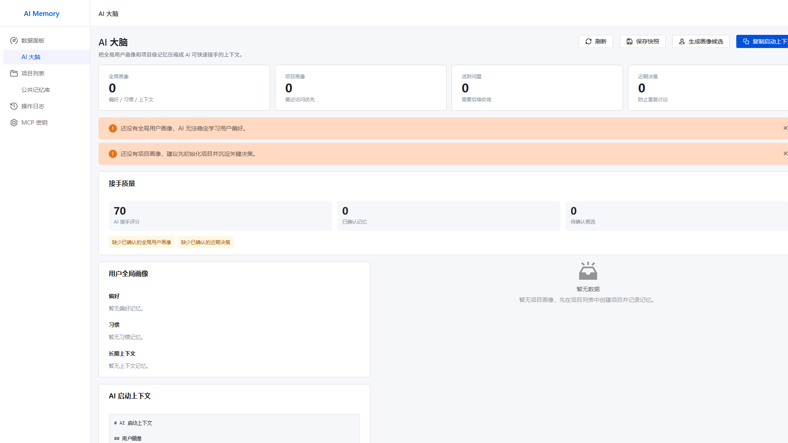
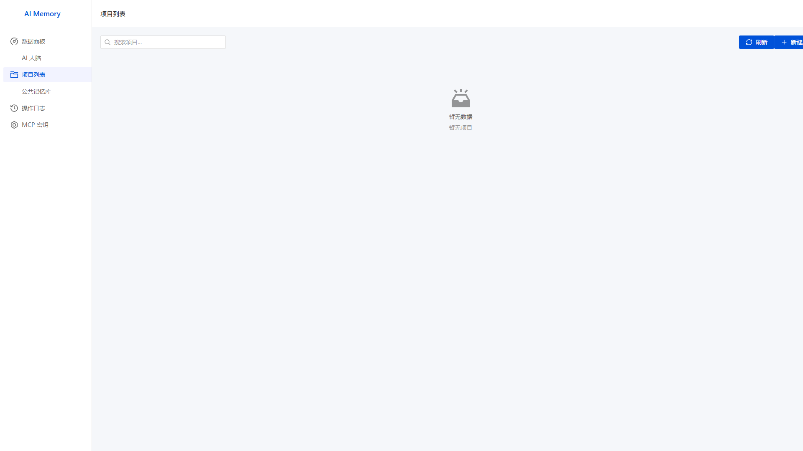
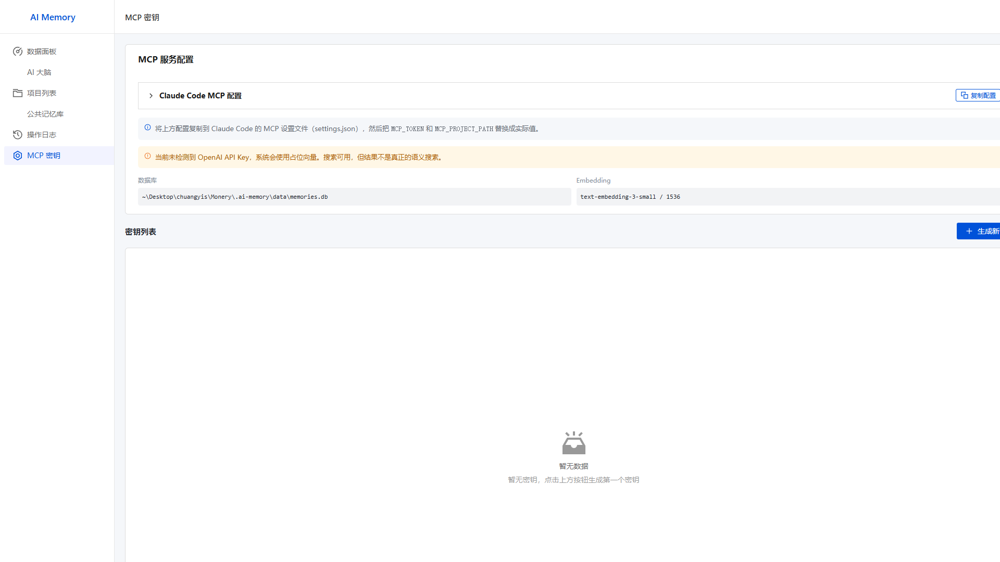

# AI Memory

AI Memory 是一个本地优先的 AI 编程助手长期记忆系统。它帮助 AI 记住项目级事实、用户全局偏好、重复决策、未解决问题、已验证修复方案和接手上下文，让 AI 更快理解项目并减少重复犯错。

AI Memory is a local-first long-term memory system for AI coding assistants. It helps an AI remember project-level facts, global user preferences, recurring decisions, unresolved problems, verified fixes, and handoff context, so the assistant can take over a codebase faster and avoid repeating past mistakes.

## 功能 / What It Does

- 存储项目记忆，包括问题、解决方案、错误、决策和笔记。
- Stores project memories such as problems, solutions, errors, decisions, and notes.
- 存储全局记忆，包括用户偏好、工作习惯和长期上下文。
- Stores global memories such as user preferences, work habits, and long-term context.
- 提供 Web UI，用于浏览、编辑、审核和删除记忆。
- Provides a web UI for browsing, editing, reviewing, and deleting memories.
- 提供 MCP 工具，让 AI 客户端可以直接读取和写入记忆。
- Provides MCP tools so AI clients can read and write memory directly.
- 为绑定项目的 Token 生成 AI 接手上下文。
- Generates AI handoff context for a project-bound token.
- 生成用户画像、项目画像和启动上下文快照。
- Creates snapshots for user profile, project brief, and startup context.
- 对比历史快照，并把有价值的变化转成待审核候选记忆。
- Compares historical snapshots and turns useful differences into review candidates.
- 全局记忆写入需要显式开启项目权限。
- Keeps global-memory writes behind an explicit project permission switch.
- MCP Token 绑定单一项目路径，避免跨项目访问。
- Restricts MCP tokens to a single project path to avoid cross-project access.

## 当前状态 / Current Status

本项目面向本地开发者使用，不是托管式多用户服务。

This project is intended for local developer use. It is not a hosted multi-user service.

## 界面预览 / Screenshots

### 数据面板 / Dashboard



### AI 大脑 / AI Brain



### 项目列表 / Projects



### MCP 密钥 / MCP Keys



后端默认监听 `127.0.0.1`，没有内置用户登录。除非你额外添加认证、TLS 和部署加固，否则不要暴露到公网。

The backend listens on `127.0.0.1` by default and does not include user login. Do not expose it to a public network unless you add authentication, TLS, and deployment hardening.

## 环境要求 / Requirements

- Node.js 20 或更高版本 / Node.js 20 or newer
- npm
- 可选：`OPENAI_API_KEY`，用于真实语义向量 / Optional: `OPENAI_API_KEY` for real semantic embeddings

没有 `OPENAI_API_KEY` 时，程序仍可运行，但搜索会使用占位向量，不是真正的语义搜索。

Without `OPENAI_API_KEY`, the app still runs, but search uses placeholder embeddings and is not true semantic search.

## 快速开始 / Quick Start

安装依赖 / Install dependencies:

```bash
npm install
```

启动后端并使用内置页面 / Start the backend and use the built-in web page:

```bash
npm run dev:server
```

打开 / Open:

```text
http://127.0.0.1:3001
```

如果你正在开发前端界面，需要 Vite 热更新，可以单独启动前端开发服务器。

For frontend development with Vite hot reload, run a separate frontend server.

```bash
npm run dev:gui -- --host 127.0.0.1
```

然后打开 / Then open:

```text
http://127.0.0.1:5173
```

正常使用只需要 `3001`。`5173` 只用于前端开发。

Normal usage only needs `3001`. Port `5173` is for frontend development.

## 初始化行为 / Initialization Behavior

首次启动时，程序会自动在项目目录下创建运行文件。

On first startup, the app automatically creates runtime files under the project directory.

```text
.ai-memory/
  config.yaml
  data/
    memories.db
```

数据库和表结构会自动创建。初始数据库包含这些表：

The database and schema are created automatically. The initial database contains these tables:

- `projects`
- `project_memories`
- `global_memories`
- `embeddings`
- `api_tokens`
- `brain_snapshots`
- `memory_review_queue`
- `operation_logs`

程序不会自动插入示例项目、示例记忆、Token 或假数据。用户需要通过 UI、CLI 或 MCP 工具创建自己的项目和记忆。

No sample projects, memories, tokens, or fake data are inserted automatically. Users create their own projects and memories from the UI, CLI, or MCP tools.

可以通过 `DATABASE_PATH` 覆盖数据库位置，但默认位置是项目内路径：

You can override the database location with `DATABASE_PATH`, but the default is intentionally project-local:

```text
.ai-memory/data/memories.db
```

运行时文件已通过 `.gitignore` 忽略。

Runtime files are ignored by git through `.gitignore`.

## 核心概念 / Core Concepts

**项目记忆** 属于单个项目，用于项目特定上下文，例如实现决策、Bug 历史、命令、环境设置、已知风险和已验证修复。

**Project memory** belongs to one project and is used for project-specific context, such as implementation decisions, bug history, commands, setup notes, known risks, and verified fixes.

**全局记忆** 跨项目生效，用于稳定的用户偏好、工作习惯和长期背景。MCP 只有在绑定项目开启全局记忆权限后才能写入全局记忆。

**Global memory** applies across projects. Use it for stable user preferences, work habits, and long-term background context. MCP cannot write global memory unless the bound project has global-memory permission enabled.

**审核队列** 存放候选记忆。快照对比和项目画像提升生成的内容会先进入审核队列，用户确认后才进入长期记忆。

**Review queue** holds proposed memories before they become long-term memory. Snapshot comparisons and profile-promotion candidates go through this queue so users can correct or reject them.

**AI 大脑快照** 保存用户画像、项目画像和启动上下文的历史版本，让 AI 的理解过程可追踪、可对比、可纠错。

**AI brain snapshots** preserve generated views of user profile, project briefs, and startup context over time. They make the memory system traceable instead of silently rewriting the AI's understanding.

**MCP Token 绑定** 限制每个 Token 只能访问一个项目路径，不能枚举或访问无关项目。

**MCP token binding** limits each token to one project path. A token cannot enumerate or access unrelated projects.

## Web 界面 / Web UI

- **数据面板 / Dashboard**：整体记忆统计和近期活动。/ Overall memory statistics and recent activity.
- **AI 大脑 / AI Brain**：用户画像、项目画像、启动上下文、快照、对比和审核队列。/ User profile, project briefs, startup context, snapshots, comparisons, and review queue.
- **项目列表 / Projects**：创建项目、查看项目记忆、开启全局记忆权限。/ Create projects, inspect project memories, and enable global-memory permission.
- **公共记忆库 / Global Memories**：管理跨项目偏好、习惯和上下文。/ Manage cross-project preferences, habits, and context.
- **操作日志 / Operation Logs**：查看创建、更新和删除历史。/ Inspect create, update, and delete history.
- **MCP 密钥 / MCP Keys**：创建项目绑定 Token、复制 MCP 配置、运行权限自测。/ Create project-bound tokens, copy MCP configuration, and run a permission self-test.

## MCP 配置 / MCP Setup

先构建后端 / Build the backend first:

```bash
npm run build:backend
```

在 **MCP 密钥** 页面创建 Token，绑定到项目，然后配置 MCP 客户端。

Create a token in the **MCP Keys** page, bind it to a project, then configure your MCP client.

```json
{
  "mcpServers": {
    "ai-memory": {
      "command": "node",
      "args": ["dist/mcp/index.js"],
      "env": {
        "MCP_TOKEN": "your-token",
        "MCP_PROJECT_PATH": "absolute-project-path"
      }
    }
  }
}
```

`MCP_PROJECT_PATH` 必须匹配 Token 绑定的项目路径。如果未绑定 Token 首次携带路径连接，服务端会按路径绑定，不会按项目名绑定，因为不同目录可能同名。

`MCP_PROJECT_PATH` must match the project path bound to the token. If an unbound token is used with a path, the server binds it by path. It does not bind by project name, because different folders can share the same name.

## MCP 工具 / MCP Tools

- `get_memory_usage_guide`：说明 AI 什么时候、怎么使用记忆。/ Explains when and how an AI should use memory.
- `get_ai_handoff`：多数编码会话的推荐首次调用。/ Recommended first call for most coding sessions.
- `get_project_context`：获取更完整的项目启动上下文。/ Provides fuller project startup context.
- `search_memories`：针对历史修复、错误、决策和偏好做定向检索。/ Targeted recall for prior fixes, errors, decisions, and preferences.
- `get_user_preferences`：读取全局用户偏好、习惯和长期上下文。/ Reads global user preferences, habits, and long-term context.
- `add_memory`：保存已验证、可长期复用的学习结果。/ Saves verified durable learning.
- `update_memory`：解决、归档、纠正或打标签已有记忆。/ Resolves, archives, corrects, or tags existing memory.
- `extract_and_store`：把日志、提交、对话或文档转成项目记忆。/ Turns raw logs, commits, conversations, or documents into project memory.
- `list_projects`：只确认当前 Token 绑定的项目。/ Confirms only the current token-bound project.

MCP 服务会在初始化时发送使用规则，兼容的 AI 客户端可以先理解记忆工作流，再选择工具。

The MCP server also sends usage instructions during initialization, so compatible AI clients can learn the memory workflow before choosing tools.

推荐 AI 工作流 / Recommended AI workflow:

1. 编码或调试开始时先调用 `get_ai_handoff`。  
   Call `get_ai_handoff` at the start of a coding or debugging session.
2. 任务宽泛、模糊、涉及架构或调试较重时调用 `get_project_context`。  
   Call `get_project_context` for broad, ambiguous, architectural, or debugging-heavy work.
3. 重复调查、改架构、修熟悉错误或依赖历史决策前调用 `search_memories`。  
   Call `search_memories` before repeating investigations, changing architecture, fixing familiar errors, or relying on prior decisions.
4. 只在信息已验证、长期有价值、具体明确时调用 `add_memory`。  
   Call `add_memory` only for verified, durable, specific learning.
5. 已有问题被解决、纠正、归档或被替代时调用 `update_memory`。  
   Call `update_memory` when a stored problem is resolved, corrected, archived, or superseded.

## CLI

先构建 / Build first:

```bash
npm run build:backend
```

使用示例 / Examples:

```bash
npm run cli -- init .
npm run cli -- add "Use UTF-8 when reading files" --type note --project .
npm run cli -- list --project .
npm run cli -- search "UTF-8 file reading" --project .
npm run cli -- stats
```

CLI 运行命令前也会自动初始化数据库。

The CLI also initializes the database automatically before running commands.

## 配置 / Configuration

可选环境变量 / Optional environment variables:

```bash
OPENAI_API_KEY=
EMBEDDING_MODEL=text-embedding-3-small
EMBEDDING_DIMENSION=1536
DATABASE_PATH=./.ai-memory/data/memories.db
AI_MEMORY_HOST=127.0.0.1
AI_MEMORY_PORT=3001
```

生成的项目本地配置文件 / Generated project-local config file:

```text
.ai-memory/config.yaml
```

## 验证 / Verification

运行 / Run:

```bash
npm run check
```

包含 / This runs:

- 后端 TypeScript 构建 / backend TypeScript build
- Vue 类型检查 / Vue type check
- 前端生产构建 / frontend production build

MCP 密钥页面还提供自测，会检查项目读写、跨项目拒绝、全局记忆权限开关和 handoff 生成。

The MCP Keys page also includes a self-test that checks project read/write, cross-project denial, global-memory permission denial/allowance, and handoff generation.

## 数据与隐私 / Data And Privacy

AI Memory 是本地优先工具，sql.js 数据库是本地文件。

AI Memory is local-first. The sql.js database is a local file.

如果配置了 `OPENAI_API_KEY`，用于生成向量的记忆内容可能会根据你的 OpenAI 账户设置发送到 OpenAI。没有 API Key 时，不会发起真实 embedding 请求。

If `OPENAI_API_KEY` is configured, memory content sent for embedding may be sent to OpenAI according to your OpenAI account settings. Without an API key, no real embedding request is made.

不要把密钥、私钥、访问 Token、密码或未脱敏凭证存入记忆。

Do not store secrets, private keys, access tokens, passwords, or unredacted credentials as memories.

## 开源注意事项 / Open Source Notes

发布前不要提交生成的运行时或构建文件 / Before publishing, do not commit generated runtime/build files:

- `.ai-memory/`
- `node_modules/`
- `dist/`
- `dist-gui/`
- `.playwright-mcp/`
- `*.db`
- `.env`

这些文件已被 `.gitignore` 覆盖。

These are already covered by `.gitignore`.

已知审计提示：当前 Vite 5 开发依赖可能报告 moderate 级 dev-server advisory，完全消除需要 Vite 的 semver-major 升级。不要把 Vite dev server 暴露到公网。

Known audit note: current Vite 5 development dependencies may report moderate dev-server advisories that require a semver-major Vite upgrade to fully remove. Do not expose the Vite dev server publicly.

